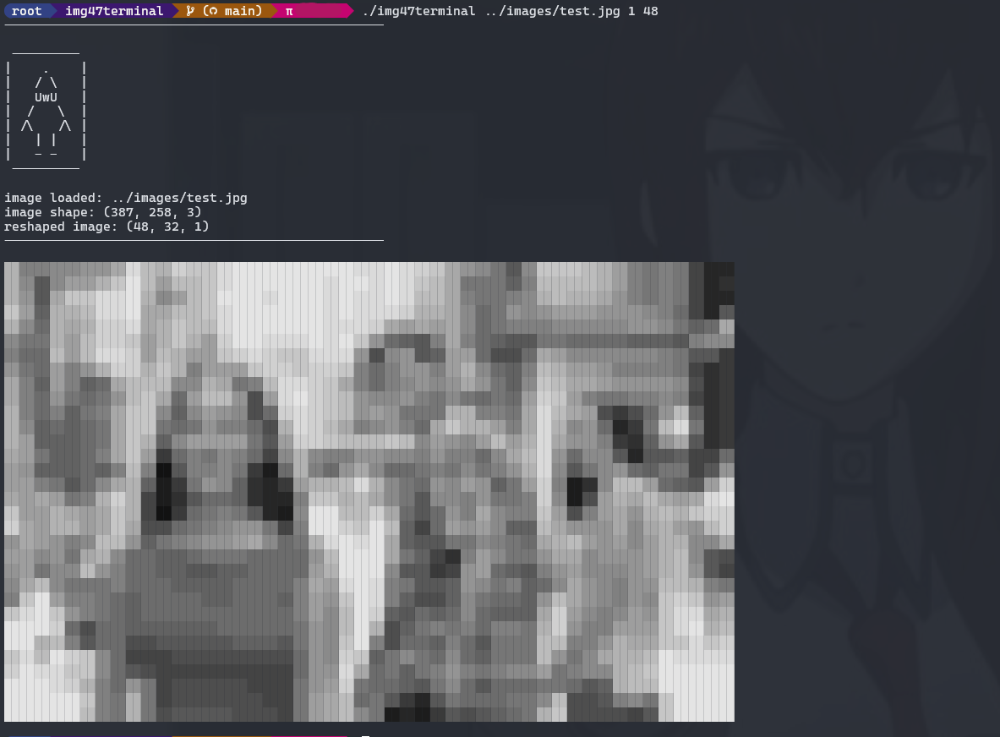

# img2x
Interacting with images in terminal
  
Current projects:
- [img47terminal](./img47terminal/img47terminal.c)
- [img2ascii](./img2ascii/img2ascii.py)

---
## img47terminal 
### demo -
<table>
<th style="text-align:center">Original</th>
<th style="text-align:center">Terminal (screenshot)</th>
</tr>
<tr>
<td></td>
<td></td>
</tr>
</table>  

### usage -
```c
gcc img47terminal.c -o img47terminal -lm
./img47terminal <imagepath> [<w>=80] [<h>=32] [<c>={1,3}]
```   
example: 



---

## img2ascii 
### demo -
<table>
<th style="text-align:center">Original</th>
<th style="text-align:center">Ascii (screenshot)</th>
</tr>
<tr>
<td></td>
<td></td>
</tr>
</table>  

### usage -
```python
python img2ascii.py <imagepath> [-v]
```

--- 
# Acknowledgements
img2ascii is inspired from [sphaerophoria](https://www.twitch.tv/sphaerophoria)!  
img47terminal is tremendously helped by [stb](https://github.com/nothings/stb) and [Richard](https://stackoverflow.com/a/33206814)!  
Image source: [Distracted boyfriend](https://en.wikipedia.org/wiki/Distracted_boyfriend)
