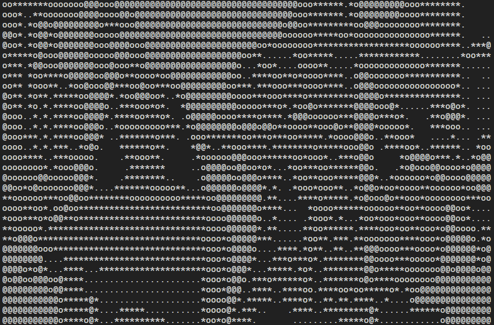

# img2x
Interacting with images in terminal
  
Current projects:
- [img47terminal](./img47terminal.c)
- [img2ascii](./img2ascii.py)

---
## img47terminal Demo
<table>
<th style="text-align:center">Original</th>
<th style="text-align:center">Terminal (screenshot)</th>
</tr>
<tr>
<td></td>
<td></td>
</tr>
</table>

## img2ascii Demo
<table>
<th style="text-align:center">Original</th>
<th style="text-align:center">Ascii (screenshot)</th>
</tr>
<tr>
<td></td>
<td></td>
</tr>
</table> 

--- 
# Acknowledgements
img2ascii is inspired from [sphaerophoria](https://www.twitch.tv/sphaerophoria)!  
img47terminal is tremendously helped by [stb](https://github.com/nothings/stb) and [Richard](https://stackoverflow.com/a/33206814)!  
Image source: [Distracted boyfriend](https://en.wikipedia.org/wiki/Distracted_boyfriend)